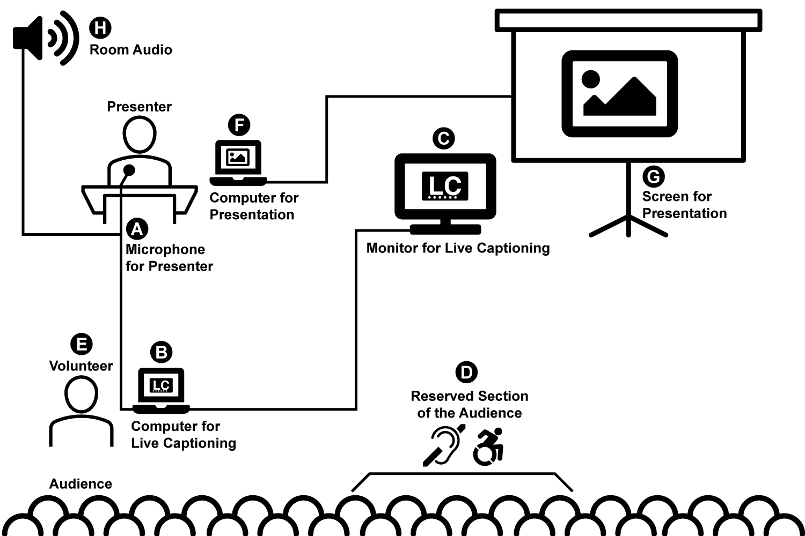

# Live Captioning

## Getting Started

1. [Visit the Live Captioning site](https://lc.midcamp.org/) using a Chrome browser desktop (version 25+). _Alternatively, you may clone this repo or download as a ZIP to your local computer and open `index.html`._
1. Click the button `Click to Caption` to begin captioning.
1. Allow use of your microphone when [prompted by the browser](images/chrome-microphone-prompt.png).
1. Begin talking. You may need to pause occasionally. Captioning will detect natural breaks and refresh the text on the screen.
1. All text displayed on the screen is saved. A transcript is available to view after the captioning session.
1. Click the text on screen to stop captioning.

## View Transcript of Captioning Session
1. Use the drop-down list to select your session. Click the button `View selected session transcript`.
1. Upon clicking this button, the transcript from your captioning session displays below.
1. Select either `SRT` `WebVTT` or `Text` format buttons. `SRT` and `WebVTT` formats contain start and end timecodes. `Text` is only plain text.
1. Click `Continue selected session` to resume captioning for this selected session.
1. Refresh browser to view the button `Start new session recording`. Click this button to start a new session. The new session name increments by a value of one _(e.g. `session_1`, `session_2`, `session_3`)_.
1. **Note for Incognito Browsing:** Session transcripts will be destroyed once you close the browser! Save all transcripts prior to closing your incognito browser window.

### Requirements
* Chrome desktop (version 25+).
* Connection to the Internet.
* JavaScript enabled.

### How Live Captioning Works
It's quite simple! This is a single HTML file that uses CSS styling and JavaScript to convert speech-to-text using the Chrome browser. All the text you see on the screen is captured and written as a transcript to your browser. You can view the transcript as either plain text, SRT, or WebVTT format (start and end timecodes). Take the transcript and reach an even wider audience once the event is over by providing transcripts for videos and SEO (Search Engine Optimization) value for event sites.

To see this in action, simply go to https://lc.midcamp.org/
Alternatively, you can download this repo and open the HTML on your local computer. You can also host these files on your own site.

## Use Live Captioning at Events or Meet-Ups

_Example diagram of an event using Live Captioning. Use the letters in the diagram to learn more about the setup._

**A. Microphone for Presenter**
* Place an external microphone near the person speaking for the best results. The better the audio input, the better the captioning output.
* Connect the external microphone to the computer dedicated to Live Captioning.
  * Ideally, use a 15-foot cable or more to reach the computer.
  * Make sure the computer is configured to use the external microphone.
* Multiple People Presenting:
  * Captioning works best when it has a strong signal and is focused on the primary person speaking. Increased background noise confuses the signal and degrades the accuracy of the speech to text.
  * Live Captioning does not determine speaker identity. Speech captured from different speakers is not separated or differentiated by the tool.
* _Optional Configuration: Split the audio signal from the room audio and send to the computer dedicated to Live Captioning._

**B. Computer for Live Captioning**
* Dedicated computer that uses the Live Captioning tool to convert speech to text.
* Internet connection.
  * Ideally, hard-wired to the Internet.
  * WiFi is discouraged due to lag and potential disconnections.
* Audio input for connection to the external microphone or room audio.
* HDMI output for connection to monitor / TV screen.
* Chrome desktop browser (version 25+).
* JavaScript enabled.

**C. Monitor for Live Captioning**
* HDMI input for connection to the computer dedicated for Live Captioning.
* Placement of the monitor / TV screen should be:
  * Near the main presentation screen to allow people to easily look back and forth.
  * Direct line of sight for the reserved section of the audience.
  * Not distracting to the person presenting.
* Size and placement of the monitor / TV screen should be decided by:
  * Room dimensions. The larger the room, the larger the monitor.
  * Size of the captioning text on the screen.
  * Proximity of the audience to the presenter _(e.g. if the person speaking is on a stage or riser)_.

**D. Reserved Section of the Audience**
* Area for best viewing the captioning tool. This allows the audience that will benefit the most to have the optimal experience. This is as simple as sectioning off an area on the floor with tape or adding "RSVP for Live Captioning" signs to chairs.

**E. Volunteer**
* Dedicated person responsible for the Live Captioning computer during the event.
* Starts and stops captioning sessions for the event.
* Ensures Live Captioning is functioning properly and has a strong audio signal.
* Troubleshoot any issues _(e.g. connection to the Internet, monitor display, microphone)_.
* Determine when a new session should be started versus when a previous session should be continued.
* Ensure the location of the Live Captioning monitor / TV screen is sufficient.
* Assist the audience and make any adjustments to the set up as necessary.

**F. Computer for Presentation**
* Dedicated computer for the presenter.
* Any videos used in the presentation should provide self-contained captioning.
* Any audio used in the presentation should provide queues for the audience.
* Not connected to Live Captioning.

**G. Screen for Presentation**
* Displays screen of presenter's dedicated computer.
* Not connected to Live Captioning.

**H. Room Audio**
* Ensure all people speaking have microphones.
* Ensure the room audio is sufficient for the needs of the audience.
  * Always test the room audio prior to the start of any event.
  * Confirm the physical space is accessible.

## Known Issues
The following are known issues:

* **Timeout.** The connection may time out after an extended period of time or if the audio signal is not strong and consistent. In our experience, captioning works best when the microphone has a strong input signal. To fix, you can press the `Reconnect` button at the bottom of the page. Your second option is to refresh your browser. When using Live Captioning at Meet-Ups or Events, we assigned a volunteer to the computer to monitor activity and refresh the connection as necessary.

* **Text extending off the page.** When a person speaks continuously without breaks, the text will continue to render off the page. This is due to the fixed positioning of the text within the page. To fix, you can either:
  * Press the `Reconnect` button at the bottom of the page.
  * Refresh your browser.
  * Wait until the speaker has a natural break. Captioning will reset.
  * If you have downloaded or are self-hosting the files, you may adjust the size of the text and colors via the CSS in `css/live-captioning.css` as needed.

* **Browser remembering microphone settings.** Chrome has the ability to remember that you allowed access to the microphone. Review this setting here:
  * Open Chrome.
  * Click on the Settings icon, located on the top right of your browser window and is represented by either three dots or three horizontal lines (known as the Hamburger Menu); this will open up a dropdown menu, and Settings will be located to the bottom of the screen.
  * You can also type in chrome://settings/ into the address bar to locate the page
  * Mac OS X users can also open the Settings page by choosing Chrome > Preferences or hit `⌘,` (Command key plus the comma key).
  * Under "Privacy and security," click "Content settings."
  * Click "Microphone."
  * Turn "Ask before accessing (recommended)" on or off.
  * Review the list of sites under "Block" or "Allow" to see if your site is being blocked.

* **Host on a site using SSL certificates.** In our experience, hosting the HTML/CSS/JS files on a site at a URL using HTTPS produces the best results to keep the website listed in the "Allow" section of Chrome settings. This stops Chrome from continuously asking for [permission to use your microphone](images/chrome-microphone-prompt.png).

## Additional Information
Chrome supports the Web Speech API, a mechanism for converting speech to text on a web page. It uses Google's servers to perform the conversion. Using the feature sends an audio recording to Google (audio data is not sent directly to the page itself), along with the domain of the website using the API, your default browser language and the language settings of the website. Cookies are not sent along with these requests. More information can be found here:
* https://developers.google.com/web/updates/2013/01/Voice-Driven-Web-Apps-Introduction-to-the-Web-Speech-API
* https://wicg.github.io/speech-api/

## Contributing
Pull requests, issues, and good advice are all things that would make a difference to this project. You can contribute by telling us how useful Live Captioning is to you; please let us know on Twitter at [@andrewozone](https://twitter.com/@andrewozone) and [@qymanaonaquest](https://twitter.com/@qymanaonaquest). Any time generously donated to help make this project better is gratefully accepted.

Donations are gratefully accepted on [Open Collective as the Live Captioning Initiative](https://opencollective.com/live-captioning-initiative).

## About
This tool was developed to caption the Midwest Drupal Camp ([MidCamp](https://www.midcamp.org/)) in Chicago when a hearing impaired individual asked about accessibility. According to him, this approach worked amazingly well. While it was not perfect, it was a game-changer for him. Before, he would never go to camps. Now, he wants to go to all the camps. We are excited to share and continue to refine.

Our goal is not to replace CART (Communication Access Real-time Translation) or Interpreters. Instead, we are aiming to provide a reliable, no-cost tool to make events more accessible where there would otherwise be nothing. Unfortunately, there isn't always enough budget to meet the needs of all your attendees. This project is an effort to make events more accessible in the face of the financial barrier.

Live Captioning is our first open source project, and your suggestions and feedback are welcome. The project is in a pre-beta phase and is liable to change at any time.

## Credits
This approach is based on the following CodePen created by Dave Rupert [@davatron5000](https://twitter.com/@davatron5000).
https://codepen.io/davatron5000/pen/IKAxb

Thanks to Fatima Sarah Khalid [@sugaroverflow](https://twitter.com/@sugaroverflow) for suggesting this CodePen and inspiring the first version tested at Midwest Drupal Camp (MidCamp) 2019 in Chicago, Illinois.

Thanks to Burton Kent for your feedback and insight.
